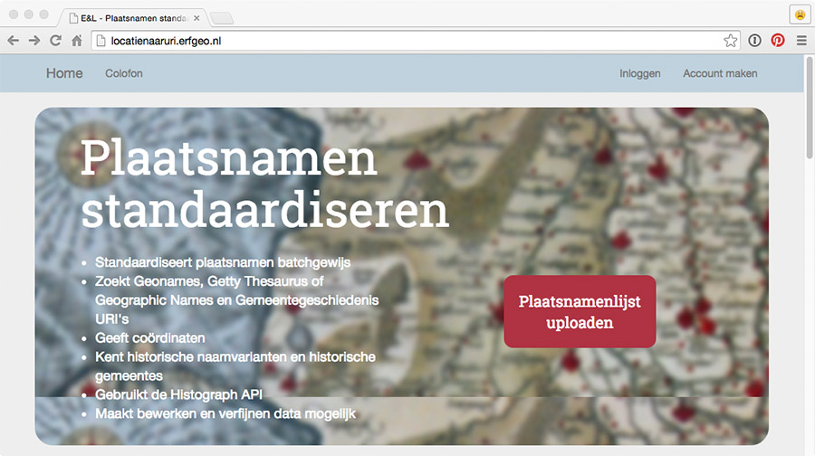
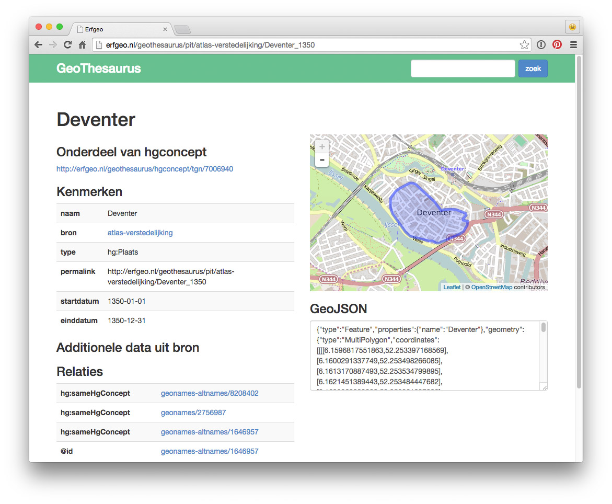
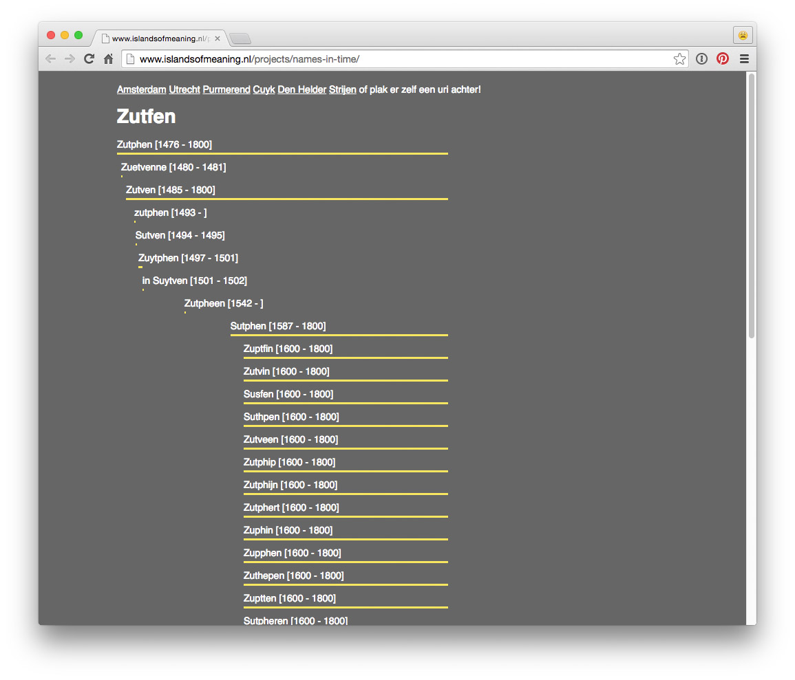
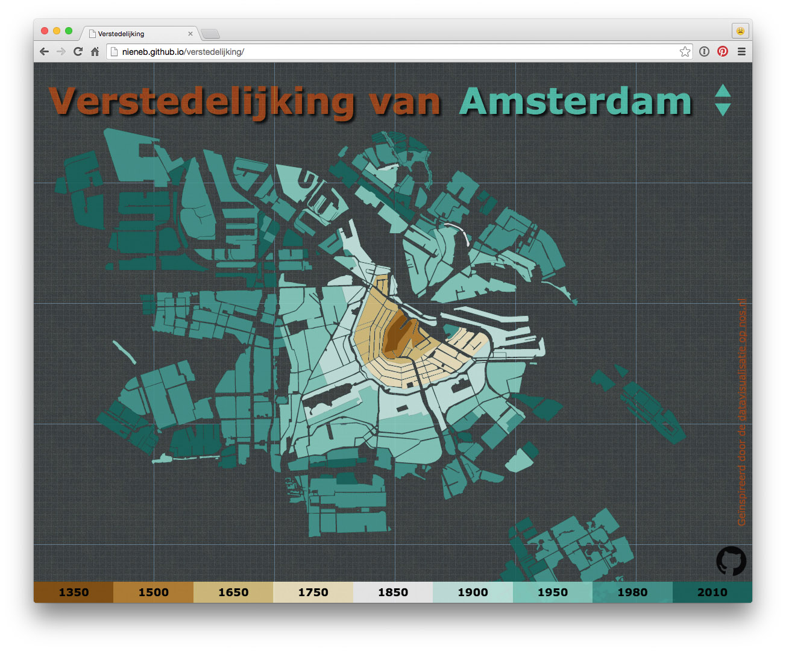

---
---

### Plaatsnamen Standaardiseren

[http://locatienaaruri.erfgeo.nl/](http://locatienaaruri.erfgeo.nl/)

### Geothesaurus

[http://erfgeo.nl/geothesaurus/](http://erfgeo.nl/geothesaurus/)

### Names-in-Time

[http://www.islandsofmeaning.nl/projects/names-in-time/](http://www.islandsofmeaning.nl/projects/names-in-time/)

### Atlas van de Verstedelijking

[http://nieneb.github.io/verstedelijking/](http://nieneb.github.io/verstedelijking/)

