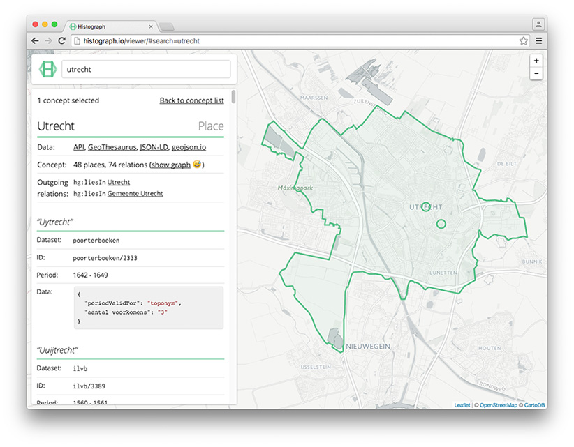

---
---

#### __Histograph__: geocoding places of the past

Our cultural heritage is a rich source of open data about places and events in time. Metadata and digital objects are meticulously collected, curated and annotated by specialists in  museums, archives, libraries all over the world. The availability of these historical data is increasing fast but collections remain hard to search geographically.

Enter Histograph: a historical geocoder for search and standardization of place names throughout history. For example, people used different names for the city of The Hague: _'s-Gravenhage_, _Vander Haegen_, _Haga Comitis_, _Den Haege_, _La Haye_, _De Haach_, _In den Haige_, _Schravenhaegen_ and _'t Haagie_. Histograph collects and links place names and uses these to georeference and standardize place names in time; currently, sources used include birth places of Dutch East India Company crew members, monastry records and historical census data.

#### Examples

- [Hengelo, Overijssel and Hengelo, Gelderland](viewer#search=hengelo)
- [Places on the sea](viewer#search="*zee"%20type=hg:Place)
- [Coriovallum, Heerlen's Roman name](viewer#search=coriovallum)
- [Municipality of Leeuwarden](viewer#search=leeuwarden%20type=hg:Municipality)

#### About

Histograph uses [Neo4j](https://neo4j.com/) and [Elasticsearch](https://www.elastic.co/products/elasticsearch) to expose a web of interlinked toponyms - in space and time. These are made searchable through an [API](https://api.histograph.io); and web applications enable geo-temporal search, visualization and analysis for librarians and archivists.

Histograph is part of [Erfgoed & Locatie](http://erfgoedenlocatie.nl/) (Heritage & Location), a cooperation of [DEN Foundation](http://www.den.nl/english), [Cultural Heritage Agency of the Netherlands](https://www.culturalheritageagency.nl/en), [Bibliotheek.nl](https://bibliotheek.nl/) and [Waag Society](https://waag.org/en).

#### Getting started

Information on how to install a development version of Histograph on your computer can be [found on GitHub](https://github.com/histograph/installation), just as Histograph's [API documentation](https://github.com/histograph/api). On GitHub, Histograph consists of more than 20 repositories - see the [overview repository](https://github.com/histograph/histograph) for a description of all Histograph's modules.

Or, just use the [map viewer](viewer) to give Histograph a spin!
